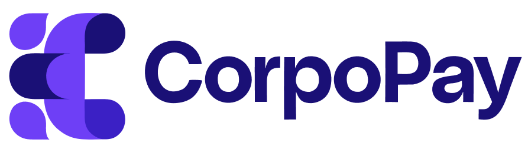
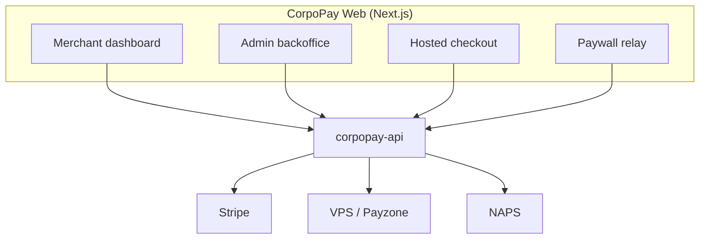

# CorpoPay Web

<div align="center">
  
</div>

[](https://github.com/CorpoPay/corpopay-web/actions/workflows/ci.yml)
[](https://github.com/CorpoPay/corpopay-web/actions/workflows/codeql.yml)
[](https://github.com/CorpoPay/corpopay-web/actions/workflows/release-please.yml)
[](LICENSE)
[](https://nextjs.org)
[](https://react.dev)

**Browser frontend for CorpoPay** — **Next.js 16 (pages router) + React 19**. Four
surfaces: merchant dashboard, admin backoffice, hosted checkout, and the paywall
relay page. Talks to `corpopay-api` through a generated openapi-fetch client.

## Architecture



## Surfaces

- **Merchant dashboard** (`/dashboard/*`) — tenants manage payment links, intents,
  transactions, subscriptions, installments, and provider configs.
- **Admin backoffice** (`/admin/*`) — super-admins manage tenants, search payments,
  monitor webhooks and provider health.
- **Hosted checkout** (`/checkout/:slug`) — customer-facing payment page.
- **Paywall relay** (`/pay/:correlationId`) — redirects to the provider's paywall.

## The contract

The API's OpenAPI spec (`corpopay-api/src/openapi.ts`) is the single source of
truth, published as the `@corpopay/contract` npm package. The web installs it:

```bash
npm install @corpopay/contract
```

Never hand-edit the generated types, or hand-write domain types,
statuses, or money literals.

## Quick start

```bash
npm install
npm run dev   # :3000 — expects the API at NEXT_PUBLIC_API_URL (default http://localhost:4000)
```

## Verify

```bash
npm run typecheck
npm run lint
npm run test
```

## Tech stack

- Next.js 16 (pages router), React 19, TypeScript
- Tailwind CSS + shadcn/ui (Radix)
- TanStack Query, react-hook-form + Zod
- Vitest

## Money & statuses

- **Money** — requests are centimes; coerce with `toMoney()` (`lib/money.ts`) and
  format with `formatAmount()` (`lib/utils.ts`).
- **Statuses** — `lib/status.ts` mirrors the Prisma enums; use `statusVariant()` /
  `statusLabel()`.

## License

MIT — see [LICENSE](LICENSE).

## Contributing

Pull requests are welcome. The domain conventions (money, statuses, the contract)
are shared with the API — see the API repo's `CONTRIBUTING.md` for the rules.
